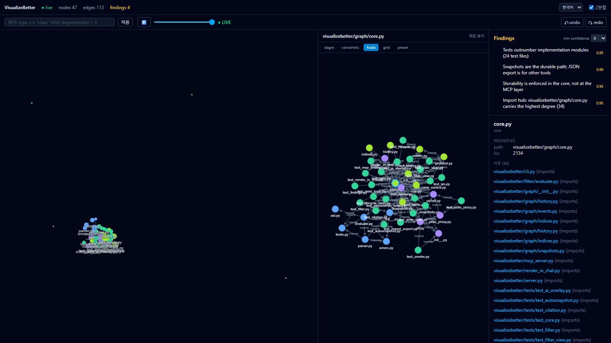

<div align="center">

# VisualizeBetter

### AI가 그리고, 당신이 보고, 다음 세션이 기억합니다.

*AI가 작업하며 실시간으로 그려 넣는 살아있는 프로젝트 그래프 — 구조, 발견,
그리고 모든 결정의 "왜"까지 — 그 세션이 끝나도 살아남습니다.*


**[English](./README.md)** | 한국어



*VisualizeBetter가 자기 자신의 저장소를 라이브로 시각화한 화면 — 개요의
backend/frontend/test 클러스터, fcose 상세 뷰, 노드 인스펙터, 그리고 findings
패널에 담긴 이 세션의 gold: 사용자와 확정한 로드맵, 기록 기준(rubric),
그리고 AI가 실측으로 자기 버그 보고를 스스로 뒤집은 그 finding.*

</div>

---

### 이런 적, 있지 않나요?

- 🕳️ AI가 결과물은 냈는데 — **어떻게 거기에 도달했는지** 궁금해졌을 땐,
  이미 디테일을 빼내기엔 너무 늦어버린 적.
- 🗺️ 점점 커지는 프로젝트, 코드는 읽기 싫고 —
  **구조 전체를 지금 당장 한눈에** 파악하고 싶었던 적.
- ✨ AI가 *Doodling…* *Unravelling…* 하는 걸 보며 **"방금 뭔가 대단한 걸 찾은 것
  같은데"** — 지금은 이 문제부터 풀어야 하니 나중에 물어봐야지… 하다가
  **그대로 까먹은 적.**
- 🧹 긴 AI 루프로 문제를 여럿 해결했는데, 컨텍스트가 차서 clear —
  **그때 날아간 분석이 아까웠던** 적.
- 🔁 새 세션마다, 새 컴퓨터마다 — **내 프로젝트를 AI에게 처음부터 또 설명**해야 했던 적.

**VisualizeBetter는 정확히 이걸 끝내려고 만듭니다.** AI가 *작업하는 그 순간에*
발견한 것을 라이브 GPU 그래프로 push합니다 — 노드, 엣지, finding, 그리고 결정의
근거까지. 다음 세션은 당신에게 다시 묻는 대신 스냅샷을 로드하고 이어갑니다.
어느 컴퓨터로든 들고 갈 수 있는 **파일 하나** — 그게 이 프로젝트가 가는 방향입니다
(로드맵, M3+).

---

**VisualizeBetter**는 AI가 발견한 것을 라이브 GPU 그래프로 push하는 MCP 네이티브
워크스페이스다 — 프로젝트의 구조가, 그것을 알아낸 세션이 끝나도 살아남도록.
AI 네이티브 앱을 많이 만들다 보면, 기능이 쌓인 뒤의 모든 변경은 내 코드베이스를
다시 알아내는 일로 시작된다 — 새 AI 세션은 아무것도 모르고, 지난 세션의 이해는
세션과 함께 죽었으니까. VisualizeBetter는 그 이해를 영속적인 시각 산출물로 만든다:
AI가 구조를 발견하는 즉시 그리고, 결정적인 것은 finding으로 못박고, **왜 그 설계
결정을 내렸는지·무슨 데이터에 근거했는지**를 함께 기록하며, 다음 세션은 처음부터
재리서치하는 대신 스냅샷을 로드한다.

더 깊은 이유는, AI를 잘 지휘하는 것이 결국 **보는 문제**라는 것이다. 사람이 AI에게
좋은 지시를 주려면, AI가 다루는 정보를 사람도 같은 수준으로 봐야 한다 — 전부, 한눈에,
가장 정리된 형태로. 수백 노드의 구조는 애초에 산문에 담기지 않는다. 채팅 로그 스크롤에
묻힌 채로는 검증도, 교정도, 지휘도 안 된다. 같은 지식을 그래프로 화면에 올리면 사람이
가리킬 수 있고, 루프가 실제가 된다: AI가 그리고, 사람이 보고 반응하고, AI가 그 반응을
읽고 더 그린다.

내부는 Python 백엔드(FastMCP + FastAPI/WebSocket, SQLite 스냅샷, Lark 기반 필터 DSL)가
React 19 + TypeScript 프론트엔드를 구동하고, 100K 노드 개요는 WebGL 위의 cosmos.gl,
상세 뷰는 cytoscape.js가 맡는다 — 로컬 웹앱 또는 Tauri v2 데스크톱 셸로 패키징.
100% 로컬, MIT 라이선스.

*MCP = [Model Context Protocol](https://modelcontextprotocol.io) — Claude Desktop, Cursor 등
AI가 외부 도구를 호출할 때 쓰는 표준 프로토콜.*

**상태: M2 Feature Complete (2026-07-19).** M1 MVP + M2(stdio 프록시·Tauri 데스크톱
앱·MCP Apps 인라인 렌더·undo/redo·다중 export 포맷) 구현·검증 완료 — 백엔드 pytest
1129 / 프론트 vitest 288 / Playwright E2E 21. `uv run visualizebetter serve` 로 실행,
Claude Desktop 은 `visualizebetter mcp-stdio` 로 연결.

---

## 빠른 시작

SPA 는 소스에서 빌드하며 저장소에 커밋하지 않는다. 그래서 갓 클론한 상태에서는
브라우저 UI 를 보기 전에 빌드 한 번이 필요하다.

**전제 조건**

| | |
|---|---|
| Python | 3.11 이상 |
| [uv](https://docs.astral.sh/uv/) | 최신 버전 — 파이썬 의존성을 설치한다 |
| Node.js | 22 (CI 가 쓰는 버전) |

```bash
git clone https://github.com/chldbwnstm/VisualizeBetter.git
cd VisualizeBetter

# 1. 프론트엔드 번들 빌드 (최초 1회, 이후 프론트 변경 시마다)
cd frontend
npm ci
npm run build
cd ..

# 2. 서버 실행 — 브라우저가 자동으로 열린다
uv run visualizebetter serve --port 8765
```

포트는 아무거나 써도 된다. `--port` 가 있는 이유는 8765 가 이미 점유돼 있을 수
있기 때문이다(띄워둔 인스턴스나 다른 프로그램) — 서버는 조용히 공유하지 않고
바인드를 거부한다.

**데이터가 어디에 저장되나.** 전부 이 컴퓨터에 남는다. 스냅샷과 서버 상태는
플랫폼 데이터 디렉토리에 저장된다 — Windows `%LOCALAPPDATA%isualizebetter`,
Linux `~/.local/share/visualizebetter`, macOS
`~/Library/Application Support/visualizebetter`. `--data-dir <경로>` 로 원하는
곳에 둘 수 있고, 프로젝트별로 그래프를 분리하는 방법이기도 하다.

1번을 건너뛰어도 치명적이지는 않다. 서버는 뜨고 MCP/JSON/WebSocket API 도 동작하며,
브라우저에는 어떤 빌드 명령이 빠졌는지 알려주는 503 이 표시된다.

**AI 클라이언트에 등록** (Claude Desktop, Claude Code, Cursor):

```jsonc
{
  "mcpServers": {
    "visualizebetter": { "command": "visualizebetter", "args": ["mcp-stdio"] }
  }
}
```

---

## 왜 만드는가

### 1. AI가 찾은 "gold"는, 한눈에 보이게 기록되지 않으면 버려진다

AI가 무언가를 분석하다 보면, 마치 광산에서 금맥을 찾듯 결정적인 정보를 발견할 때가 있다.
"이 클래스가 결제 실패의 진원지다", "이 두 모듈이 사실은 순환 참조로 얽혀 있다" —
몇 시간짜리 분석의 값어치가 담긴 발견.

문제는 이 gold가 **텍스트 대화 속에 묻힌 채 흘러간다**는 것이다.
수백 줄의 분석 로그 어딘가 한 문장으로 남고, 세션이 끝나면 그대로 사라진다.
사람이 한눈에 알아볼 수 있게 **구조로 기록되지 않으면**, 금덩이가 그냥 휴지통에 들어가 삭제되는 셈이다.

수백 개 노드로 이뤄진 구조는 애초에 문장으로는 보이지 않는다.
`OrderService`는 +0x58에 `AccountTier` 필드가 있고 `PaymentService`에서 참조되고... 를
읽어서 머릿속에 그래프를 다시 그리는 것은 느리고, 부정확하고, 곧 잊힌다.

**VisualizeBetter는 발견을 발견한 그 순간에 그래프로 남긴다** — AI가 문장으로 "말하는" 게 아니라
노드/엣지로 push하고, 결정적 발견은 **finding(골드 너깃)**으로 별도 표시되어
화면에서 강조된 채 남는다. 금덩이가 휴지통이 아니라 진열장에 놓인다.

### 2. AI가 만든 프로그램은, 나중엔 AI 자신도 모른다

7일 동안 AI에게 리서치를 시키고 그 결과로 프로그램을 만들었다고 하자.
한 달 뒤 기능 하나를 추가하거나 고치고 싶어질 때 문제가 시작된다:

- **나는 그 코드를 깊이 이해하지 못한다** — AI가 만들었으니까.
- **새로 연 AI 세션도 그 코드를 모른다** — 이전 세션이 알아낸 것은 세션과 함께 사라졌으니까.
- 결국 **같은 리서치와 코드 분석을 처음부터 다시** 시켜야 한다.
  기능을 추가할 때마다, 매번, 같은 비용을 다시 낸다.

세션이 끝나면 AI가 알아낸 구조·관계·근거는 기껏해야 markdown 조각(CLAUDE.md, 분석 노트)으로 남는다.
다음 세션이 그 텍스트를 다시 읽을 수는 있다 — 하지만 수백 노드 규모의 구조는 문장으로는 보이지 않고,
여러 세션·여러 AI의 발견이 하나로 병합되지 않으며, "이 클래스에 연결된 미개척 필드는?" 같은 질의도 할 수 없다.
결국 다음 세션은 텍스트를 통째로 다시 읽고 머릿속에서 그래프를 재구성해야 한다.

**VisualizeBetter는 이 지식을 로드 가능한 시각적 기록으로 남긴다:**
다음 세션의 AI는 스냅샷을 불러와 개요를 잡고, 이미 표시된 finding부터 읽고,
필요한 부분만 조회하며 이어간다. 처음부터 다시 리서치하지 않는다.

### 3. 코드는 남지만, 그렇게 짠 "이유"는 남지 않는다

AI가 구조를 설계하고 코드를 짜면 **결과물은 저장소에 남는다. 하지만 왜 그렇게 했는지는 남지 않는다.**

- 왜 이 데이터 모델인가. 같이 검토했던 다른 안은 왜 버렸나
- 이 수치(배치 크기, 타임아웃, 상한)는 무슨 측정에 근거해 정해졌나
- 이 코드는 **의도된 결정**인가, 아니면 그냥 그렇게 되어버린 것인가

한 달 뒤 이 셋을 구분할 수 없으면 실패는 양방향으로 온다. 건드리면 안 되는 걸 "개선"해
깨뜨리거나, 고쳐도 되는 걸 무서워서 못 건드린다. 새로 연 AI 세션은 더 심하다 — 기각된
근거를 모르니 **이미 버린 설계를 자신 있게 다시 제안한다.**

**VisualizeBetter는 결정을 이유·데이터와 함께 기록한다.** finding은 자유 서술이 아니라 구조를
갖는다: 어떤 노드에 대한 판단인지(`node_ids` 앵커), 무엇을 근거로 했는지(`evidence`),
얼마나 확신하는지(`confidence`). 그리고 결정에는 이력이 남는다 —
**낡은 결정은 `supersede`**(이전 값을 보존한다. 한때 참이었던 것을 지키는 게 이 프로젝트의
요점이므로), **틀린 결정은 `correction`**(틀린 값은 버리고 정정 사실만 남긴다. 거짓으로
밝혀진 값을 남겨두면 그건 소음이므로).

#### 실제 사례 — 이 도구가 자기 자신의 "버그" 보고를 뒤집었다

2026-07-28, 이 저장소 자체를 VisualizeBetter로 시각화하던 중 실제로 일어난 일:

1. AI가 저장소를 임포트 그래프(노드 99 / 엣지 203)로 그린 뒤, 화면을 보고
   **"상세 뷰가 패널에 안 맞게 축소 렌더된다"를 버그 finding으로 기록했다.**
   근거가 육안뿐이었으므로 confidence 0.7 — gold 문턱(0.9) 아래, `unverified` 태그.
2. "고쳐줘"라는 지시를 받자 AI는 코드를 바로 고치는 대신 **캔버스 픽셀을 실측했다.**
   4개 레이아웃 전부에서 그려진 폭이 `fit()`에 지정한 패딩과 픽셀 단위로 일치 —
   버그가 아니라, 좁고 긴 패널에 가로로 넓은 그래프를 넣은 **종횡비 보존의 정상 동작**이었다.
3. finding은 `correction`으로 정정됐다. 측정값, 기각된 가설 2개, 그리고 "육안 관찰을
   확정으로 기록한 것 자체가 과대 주장이었다"는 교훈까지 그래프에 남았고,
   **코드는 한 줄도 바뀌지 않았다.**

다음 세션의 AI는 `list_findings()`로 이것을 읽고 같은 "버그"를 다시 조사하지 않는다.
이것이 이 도구가 약속하는 루프다: **주장 → 근거 → 정정이 전부, 지워지지 않고, 그래프에 남는다.**

### 4. 기존 도구에는 이 조합이 없다

그래프 DB(Neo4j)는 쿼리 언어(Cypher) 학습이 필요하고 시각화에는 별도 툴(전용 툴 Bloom은 유료)이 필요하다.
정적 뷰어(Gephi/yEd)는 파일을 로드해 보는 방식이라 AI 실시간 push가 안 된다.
MCP 차트 서버들은 차트 위주라 노드-엣지 그래프나 대규모(100K+) 처리에 특화되어 있지 않다.
"MCP 네이티브 + 실시간 쌍방향 + GPU 대규모 + 로컬 우선"을 한 번에 갖춘
오픈소스는 아직 없다.

---

## 어떻게 해결하나

지식이 증발하지 않게 만드는 것이 이 프로그램의 핵심이다. 위 문제들을 구체적인 메커니즘으로 푼다.

| 문제 | VisualizeBetter의 해법 |
|---|---|
| **발견이 대화 속에 묻혀 사라짐** | AI가 분석 중 **발견한 그 순간** push → 그래프는 사후 보고서가 아니라 작업 중인 기억 그 자체 |
| **gold가 로그 속 한 줄로 버려짐** | `record_finding()` — 결정적 발견을 **finding**(1급 기록)으로 못박아, 전용 패널·강조로 표시. 수천 개 구조 노드 사이에 묻히지 않음 |
| **"AI가 지어낸 것 아냐?"** | `cite()` — 모든 발견에 근거(IDA 주소, 문서 URL) 첨부. 나중에 다시 봐도 검증 가능 |
| **왜 그렇게 짰는지가 안 남음** | 결정을 **이유·데이터와 함께** finding으로 — 앵커(`node_ids`)·근거(`evidence`)·확신도(`confidence`). 코드가 아니라 **판단**이 남는다 |
| **낡은 결정과 틀린 결정이 뒤섞임** | `update_finding(reason=...)` — `supersede`(유효했으나 낡음 → 이전 값 **보존**) / `correction`(틀림 → **폐기**하고 정정 사실만). 결정의 변천사가 그래프에 남음 |
| **누가 뭘 발견했는지 모름** | 모든 push는 **layer**(어느 AI/세션)로 자동 태깅 — 세션·AI별 attribution·병합·on/off |
| **세션 끝나면 다 날아감** | **스냅샷**(SQLite) 저장/복원 + **자동 스냅샷**(주기적·파괴적 작업 직전) → 갑자기 세션이 끊겨도 gold가 살아남음 |
| **다음 세션이 처음부터 재리서치** | **핸드오프 프로토콜** — 새 세션은 스냅샷 로드 → `get_graph_summary()` 개요 → `list_findings()`로 gold 먼저 읽기 → 필요분만 드릴다운 |
| **구조가 머릿속에서만 보임** | 화면에 렌더링된 그래프 + 인스펙터(노트·근거·태그) → 사람이 한눈에 파악, 재구성 불필요 |

### 세션 인수인계(핸드오프)는 이렇게 흐른다

```
[세션 A]  AI가 분석 → push_node/push_edge (발견 즉시)
                    → cite() (근거 첨부)
                    → record_finding("결제 실패의 핵심 경로", node_ids=[...])   ← gold 표시
          세션 끝    → save_snapshot("프로젝트-구조-v1")   (자동 스냅샷도 병행)
                          │
                          ▼  (다음 날, 새 AI 세션)
[세션 B]  AI 시작     → load_snapshot("프로젝트-구조-v1")
                    → get_graph_summary()     전체 개요 (노드/엣지/타입/허브)
                    → list_findings()         ★ 이전 세션의 gold 먼저 읽음
                    → get_neighbors(...)      필요한 부분만 드릴다운
          → 재리서치 없이 이어서 작업
```

어떤 AI에게든 줄 수 있는 시스템 프롬프트 한 줄로 이 습관을 강제할 수 있다(예정):
> "작업 시작 전 VisualizeBetter 스냅샷을 로드하고 `list_findings()`로 기존 발견을 먼저 확인하라."

---

## 무엇인가

| 특징 | 설명 |
|---|---|
| **MCP 네이티브** | Claude Desktop, Cursor, Cline 등 MCP 호환 AI라면 무엇이든 연결 |
| **실시간 push** | AI가 노드/엣지를 push하면 브라우저에 즉시 반영(WebSocket) |
| **실시간 pull** | AI가 "사용자가 지금 뭘 보고 있는지"(focus/필터/뷰 상태)를 조회해 반응 |
| **finding(골드 너깃)** | 결정적 발견을 근거·확신도와 함께 못박아 강조 — 지식 캡처의 핵심 |
| **이중 렌더링** | cosmos.gl(WebGL GPU 그래프 렌더러) overview + cytoscape.js(노드-엣지 정밀 뷰) 상세 뷰 |
| **필터 DSL** | 예: `properties.ns startsWith "app.ui" AND degree(node) > 5` |
| **스냅샷** | 세션 지식의 저장/복원(SQLite) + 자동 스냅샷 — 세션 간 지식 인수인계의 핵심 |
| **Layer** | push 주체(AI 세션)별 자동 태깅 — on/off·색상·attribution |
| **UI 언어** | 한국어 / English — 헤더에서 전환 (그래프 데이터는 그대로, UI 크롬만 번역) |
| **도메인 무관** | schema-less(임의 K/V properties) — 코드, API, 조직도, 무엇이든 |
| **100% 로컬** | 외부 통신 없음, 텔레메트리 없음, 모든 asset self-hosted |

100K는 목표가 아니라 실측이다. 메인테이너 장비(RTX 4070 SUPER), 100K 노드 기준:
렌더 **59.9 FPS**, 대량 import **15초**, AI 의 push 가 노드로 **그려지기까지 92 ms**
— 셋 다 각자의 기준(≥30 FPS, <30초, <100 ms) 안이고, 전부 이 저장소의 하니스가
다시 잰 값이다.

마지막 수치에는 알아 둘 만한 이력이 있고, 그게 나머지를 믿을 근거이기도 하다:
예전에 73.9 ms 를 공표했다가 재현하지 못했다. 조사 결과 원인이 **둘**이었다 —
옛 측정이 WebGL 작업 **앞에서** 시계를 멈췄고, 게다가 나중에 들어온 기능이 push
경로에 그래프 전체 스캔을 얹고 있었다. 종료점은 이제 관측으로 유추하지 않고
애플리케이션이 직접 찍는다(그래서 바는 더 **어려워졌다**), 회귀는 고쳤다. 기준은
움직이지 않았다. before/after 페어 실측과 전말은
[docs/benchmarks.md § Resolved](./docs/benchmarks.md#resolved-why-the-live-push-figure-did-not-reproduce)
에 있다(영문).

하니스·픽스처 생성기·재현 절차는 [docs/benchmarks.md](./docs/benchmarks.md) 에
있고, 무엇을 보장하지 **않는지**도 함께 적었다 — 성능 프로브는 손으로 돌리는
것이지 CI 게이트가 아니다(CI 가 막는 것은 기능 e2e 스위트다).

---

## 어떻게 동작하나

```
AI (Claude / GPT / Cursor / Cline ...)
  │  MCP tools: push_node · push_edge · record_finding · cite
  │             get_focused_node · poll_events · save_snapshot ...
  ▼
visualizebetter serve                         ← 그래프를 소유하는 단일 로컬 프로세스
  ├─ Graph Core (in-memory + 인덱스 + 필터 엔진 + finding/citation 저장)
  ├─ MCP endpoint (stdio 는 얇은 프록시로 이 프로세스에 중계)
  ├─ Snapshot store (SQLite, 자동 스냅샷 포함)
  └─ WebSocket Hub
       │  실시간 이벤트 (batch/coalescing, seq 기반 무손실 resync)
       ▼
     브라우저 (localhost)
       ├─ cosmos.gl overview   — 전체 그래프 (GPU)
       ├─ cytoscape.js detail  — 선택 노드 + N-hop 이웃 (필드/화살표/라벨)
       ├─ findings 패널        — 강조된 gold 목록
       └─ 필터·클릭·노트  ──→  AI가 다시 조회 (co-exploration 루프)
```

핵심 루프: **AI가 그리고 → 사람이 보고 반응하고 → AI가 그 반응을 읽고 → 더 그린다.**

구현 스택: Python 백엔드(FastMCP + FastAPI/WebSocket) + React 19/TypeScript 프론트엔드.

**성능(브라우저 무렉)이 핵심 설계 목표다.** 그래프 렌더링은 cosmos.gl(WebGL/GPU)이
담당하므로 프레임워크가 아니라 렌더러가 속도를 결정하고, 라이브 push의 lag는
requestAnimationFrame 배칭 + 대용량 데이터를 React 밖에 두는 전략으로 막는다
(M1 하드 요건 — "10K 노드에 초당 1000건 push를 흘려도 pan/zoom 무렉"이 인수 기준).

**배포:** M1은 로컬 웹앱(`visualizebetter serve` → 브라우저 탭)이라 Python+브라우저만으로
Windows/Mac/Linux에서 바로 돈다. M2에서 **Tauri v2 데스크톱 셸**(OS 웹뷰 사용, 번들
~5–10MB)에 Python을 사이드카로 묶어 네이티브 앱을 낸다. 크로스플랫폼 설치본은
GitHub Actions 매트릭스(Windows/Mac 러너)로 빌드·서명한다. (웹앱 배포는 계속 유지)

---

## 이런 데 쓴다

- **AI가 만든/분석한 코드베이스의 구조 기록** — 다음 세션에 스냅샷으로 인수인계
  (위 "왜 만드는가 2번" 시나리오)
- **리버스엔지니어링** — ELF/PE/Mach-O 클래스·필드·참조 맵 (프로젝트의 원 동기)
- **웹 API 스키마 매핑** — endpoint/model/enum 관계
- **파일시스템·의존성 그래프** — 수만 노드 규모 프로젝트 스캔
- **조직도·워크플로 등 임의 관계 데이터** — 도메인 무관

---

## 사용 예

```bash
# 소스에서 서버 실행 (PyPI 배포는 준비 중)
uv run visualizebetter serve --port 8765          # 브라우저 자동 오픈

# Claude Desktop / Claude Code 에는 stdio 프록시로 등록
#   command: visualizebetter  /  args: ["mcp-stdio"]
```

```
사용자: "이 프로젝트 구조 분석해서 그래프로 그려줘"
Claude: push_node / push_edge 로 발견 즉시 시각화
        cite() 로 근거 첨부, record_finding() 으로 핵심 발견 표시
사용자: (브라우저에서) 필터 'type == "class"' 입력, 특정 노드 클릭
Claude: get_focused_node() → "그 노드에 미개척 필드가 3개 있어요. 확장할까요?"
사용자: "저장해줘"
Claude: save_snapshot("프로젝트-구조-v1")   ← 다음 세션이 이걸 로드해 이어감
```

---

## 로드맵

| 단계 | 내용 | 상태 |
|---|---|---|
| **M0** POC | push/조회 3 tool + 최소 뷰 + E2E 검증 | ✅ 완료 |
| **M1** MVP | 전체 MCP API, 이중 뷰, 필터 DSL(기본), 스냅샷, layer, finding, JSON import/export, 사람↔AI 공유 뷰, 성능 KPI, 보안 감사 | ✅ **기능 완성** (2026-07-18) |
| **M2** Feature Complete | MCP Apps(대화창 inline 렌더), 필터 DSL direction, GraphML/dot/cytoscape export, undo/redo, **Tauri 데스크톱 앱(Win .msi 실빌드)**, stdio 프록시(실 MCP 클라 연결) | ✅ **사실상 완성** (2026-07-19, 잔여=니치 IDA/ReClass 어댑터) |
| **M3** Production | ✅ 100K 성능 튜닝(렌더 59.9FPS·import 15s·라이브 push 92ms, [셋 다 기준 안](./docs/benchmarks.md#resolved-why-the-live-push-figure-did-not-reproduce)) · ✅ temporal(시간축 스크러버) · ⏳ 멀티유저 · ⏳ 3D 뷰 | 🚧 핵심 2/4 (2026-07-19) |

### 다음 로드맵 (2026-07-28 확정)

| 기능 | 내용 |
|---|---|
| 📅 **타임라인 뷰** | 날짜별로 — 구현된 기능들의 **reasoning 과 근거 데이터**를 한눈에. temporal 스크러버 위에 finding/결정 오버레이 |
| 🌳 **Hierarchy 모드** | force 그래프 외에 **트리/계층 레이아웃** 모드 |
| 📦 **단일 파일 save/load** | 그래프+finding+결정 이력을 **파일 하나**로 — Windows/macOS/Linux 어디서든 동일하게 열리고, 옮기면 그 지점부터 재개 |
| 📋 **우클릭 → 복사** | 노드·finding·어떤 컴포넌트든 우클릭해 클립보드로 — AI에게 **"지금 이것"**을 가리키는 가장 빠른 방법 |

---

## 문서

- [docs/handoff.md](./docs/handoff.md) — 세션 핸드오프 프로토콜 + 시스템 프롬프트
  스니펫 + 구현된 도구 레퍼런스
- [docs/filter-dsl.md](./docs/filter-dsl.md) — 필터 DSL 문법·의미론·안전 상한 정본
- [docs/benchmarks.md](./docs/benchmarks.md) — 100K 성능 수치의 측정 절차와 재현 방법 (영문)
- [KNOWN_ISSUES.md](./KNOWN_ISSUES.md) — 알려진 제약과 우회 방법 (영문)

## 라이선스

MIT
