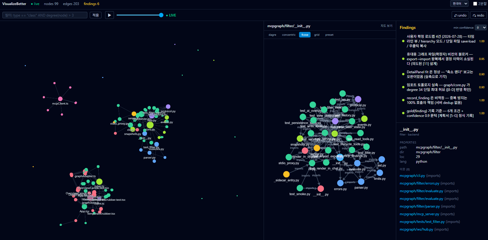

<div align="center">

# VisualizeBetter

### The AI draws. You see. The next session remembers.

*A live project graph the AI pushes into as it works — structure, discoveries,
and the "why" behind every decision — that outlives the session that made it.*


English | **[한국어](./README.ko.md)**



*VisualizeBetter visualizing its own repository, live — backend/frontend/test clusters
in the overview, an fcose detail view, the node inspector, and the findings panel
holding the session's gold: the roadmap locked in with the user, the recording rubric,
and the finding where the AI overturned its own bug report with measurements.*

</div>

---

### Sound familiar?

- 🕳️ Your AI shipped a result — but by the time you wanted to know **how it got
  there**, the trail was already cold and there was no way to pull the details back out.
- 🗺️ The project kept growing — you don't want to read the code, you just want
  **the whole structure, at a glance, right now**.
- ✨ You watched the AI spin through *Doodling…* and *Unravelling…* and could tell
  **it just found something big** — but you had a problem to fix first, so
  "I'll ask what it was later"… **and later never came.**
- 🧹 You ran a long AI loop and it solved real problems — but context filled up and
  got cleared, and the analysis that vanished with it **felt like a waste**.
- 🔁 Every new session — every new machine — and you're **explaining your own project
  to an AI from scratch, again**.

**VisualizeBetter exists to end exactly this.** The AI pushes what it discovers into a
live GPU graph *as it works* — nodes, edges, findings, and the reasoning behind
decisions — and the next session loads a snapshot and continues instead of asking you
again. One portable file you can carry to any machine is where this is headed
(roadmap, M3+).

---

**VisualizeBetter** is an MCP-native workspace where AI pushes what it discovers into a
live GPU-rendered graph, so a project's structure survives past the session that found it.
I build a lot of AI-native apps, and once the feature count grows, every new change starts
with re-discovering my own codebase — a fresh AI session knows nothing, and the last one's
understanding died with it. VisualizeBetter makes that understanding a persistent, visual
artifact instead: the AI draws the structure as it finds it, marks the decisive bits as
findings, records why each design decision was made and on what data, and the next session
loads the snapshot rather than re-researching from scratch.

The deeper reason is that directing AI well is a seeing problem. If a human is going to
give an AI good instructions, the human first has to see the same information the AI is
working with — all of it, at once, in the most organized format possible. Hundreds of
nodes of structure simply don't fit in prose; buried in a scroll of chat logs, they can't
be checked, corrected, or steered. Put that same knowledge on screen as a graph and the
human can point at it, and the loop becomes real: the AI draws, the human sees and reacts,
the AI reads that reaction and draws more.

Under the hood it's a Python backend (FastMCP + FastAPI/WebSocket, SQLite snapshots, a
Lark-based filter DSL) driving a React 19 + TypeScript frontend, with cosmos.gl on WebGL
for the 100K-node overview and cytoscape.js for the detail view — packaged as a local web
app or a Tauri v2 desktop shell. 100% local, MIT licensed.

*MCP = [Model Context Protocol](https://modelcontextprotocol.io) — the standard protocol
AI clients like Claude Desktop and Cursor use to call external tools.*

**Status: M2 Feature Complete (2026-07-19).** M1 MVP + M2 (stdio proxy, Tauri desktop
app, MCP Apps inline render, undo/redo, multi-format export) implemented and verified —
backend pytest 806 / frontend vitest 288 / Playwright E2E 21. Run with
`uv run visualizebetter serve`; Claude Desktop connects via `visualizebetter mcp-stdio`.
Details: [project plan v0.4](./VISUALIZEBETTER_PROJECT_PLAN.txt) (Korean).

---

## Why build this

### 1. The "gold" an AI finds is thrown away unless it's recorded where you can see it

When an AI analyzes something, it sometimes strikes gold — the decisive fact that hours
of analysis were for: "this class is where checkout failures originate", "these two modules are
actually locked in a circular reference".

The problem is that this gold **drifts by, buried in a text conversation.** It survives
as one sentence somewhere in hundreds of lines of analysis logs, and when the session
ends, it's gone. If it isn't captured **as structure a human can take in at a glance**,
the nugget goes straight into the trash.

A structure of hundreds of nodes was never going to fit in sentences anyway. Reading
"`OrderService` has a `AccountTier` field at +0x58, referenced from `PaymentService`,
which..." and redrawing the graph in your head is slow, inaccurate, and soon forgotten.

**VisualizeBetter records the discovery at the moment it's made** — the AI doesn't "say"
it in prose, it pushes nodes and edges, and decisive discoveries are pinned as
**findings** (gold nuggets), kept highlighted on screen. The nugget goes in the display
case, not the trash.

### 2. A program an AI built is one the AI itself won't know later

Say you had an AI do research for seven days and built a program out of the results.
A month later you want to add or fix one feature, and the problem starts:

- **You don't deeply understand the code** — the AI wrote it.
- **A freshly opened AI session doesn't know it either** — what the previous session
  figured out died with that session.
- So you end up ordering **the same research and code analysis all over again.**
  Every feature addition pays the same cost, every time.

When a session ends, the structure, relationships, and evidence the AI worked out survive
at best as markdown fragments (CLAUDE.md, analysis notes). The next session can re-read
that text — but hundreds of nodes of structure aren't visible in prose, discoveries from
multiple sessions and multiple AIs never merge into one, and you can't query it
("which unexplored fields hang off this class?"). The next session re-reads everything
and rebuilds the graph in its head.

**VisualizeBetter keeps this knowledge as a loadable visual record:** the next session's
AI loads the snapshot for an overview, reads the already-marked findings first, and
drills into only what it needs. No re-research from scratch.

### 3. The code survives, but the "why" behind it doesn't

When an AI designs a structure and writes the code, **the artifact lands in the repo.
Why it's that way doesn't.**

- Why this data model? What alternatives were considered, and why were they rejected?
- What measurement justified this number (batch size, timeout, cap)?
- Is this code a **deliberate decision**, or just how things happened to end up?

If you can't tell these apart a month later, failure comes from both directions: you
"improve" something that must not be touched and break it, or you're too afraid to touch
what could safely change. A fresh AI session is worse — not knowing the rejected
rationale, **it confidently re-proposes the design you already discarded.**

**VisualizeBetter records decisions together with their reasons and data.** A finding
isn't free prose; it has structure: which nodes the judgment is about (`node_ids`
anchors), what it's based on (`evidence`), how sure the AI is (`confidence`). And
decisions carry history — **stale decisions are superseded** (`reason="supersede"`:
the old value is archived, because preserving what was once true is the point of this
project), while **wrong decisions are corrected** (`reason="correction"`: the wrong
value is dropped and only the fact of correction kept — keeping a value known to be
false would be noise).

#### A real case — this tool overturned its own bug report

This actually happened on 2026-07-28, while visualizing this very repository with
VisualizeBetter:

1. The AI drew the repo as an import graph (99 nodes / 203 edges), looked at the screen,
   and **recorded a bug finding: "the detail view renders shrunken, not fitting the
   panel."** The only evidence was eyeballing, so it went in at confidence 0.7 — below
   the gold threshold (0.9), tagged `unverified`.
2. Told to "fix it", the AI didn't touch the code first — **it measured the canvas
   pixels.** Across all four layouts, the drawn width matched the padding passed to
   `fit()` to the pixel. Not a bug: a wide graph in a narrow, tall panel, with
   aspect-ratio-preserving fit **working exactly as intended.**
3. The finding was rewritten with `reason="correction"`. The measurements, the two
   rejected hypotheses, and the lesson ("logging an eyeball observation as confirmed was
   an overclaim") all stayed in the graph — and **not one line of code changed.**

The next session's AI reads this via `list_findings()` and never re-investigates the
same "bug". That is the loop this tool sells: **claim → evidence → correction, all of
it kept, none of it erasable by forgetting.**

### 4. No existing tool has this combination

Graph DBs (Neo4j) require learning a query language (Cypher), and visualization needs a
separate tool (the dedicated one, Bloom, is paid). Static viewers (Gephi/yEd) load files,
so there's no realtime AI push. MCP chart servers are chart-oriented, not specialized for
node-edge graphs or large scale (100K+). An open-source tool that is
"MCP-native + realtime bidirectional + GPU large-scale + local-first" in one package
doesn't exist yet. ([plan §1-B, §1-C](./VISUALIZEBETTER_PROJECT_PLAN.txt))

---

## How it solves this

Keeping knowledge from evaporating is the core of this program. The problems above are
addressed with concrete mechanisms.
(Design and implementation details: [plan §23 "knowledge persistence"](./VISUALIZEBETTER_PROJECT_PLAN.txt))

| Problem | VisualizeBetter's answer |
|---|---|
| **Discoveries drown in the conversation** | The AI pushes **at the moment of discovery** → the graph is working memory, not an after-the-fact report |
| **Gold thrown away as one log line** | `record_finding()` — pins decisive discoveries as **findings** (first-class records) with a dedicated panel and highlighting. Never buried under thousands of structure nodes |
| **"Didn't the AI just make that up?"** | `cite()` — every discovery carries evidence (IDA addresses, doc URLs). Verifiable whenever you come back |
| **The "why" behind the code isn't kept** | Decisions recorded **with reasons and data** — anchors (`node_ids`), evidence, confidence. What survives is the **judgment**, not just the code |
| **Stale and wrong decisions blur together** | `update_finding(reason=...)` — `supersede` (was valid, now stale → old value **archived**) / `correction` (wrong → **discarded**, only the fact of correction kept). The decision's history lives in the graph |
| **No idea who discovered what** | Every push is auto-tagged with a **layer** (which AI/session) — per-session attribution, merge, on/off |
| **Session ends, everything's gone** | **Snapshots** (SQLite) save/restore + **auto-snapshots** (periodic, and before destructive ops) → gold survives even a dropped session |
| **Next session re-researches from zero** | **Handoff protocol** — new session loads the snapshot → `get_graph_summary()` overview → `list_findings()` reads the gold first → drills down only where needed |
| **The structure only exists in someone's head** | Rendered graph + inspector (notes, evidence, tags) → humans take it in at a glance, no mental reconstruction |

### How a session handoff flows

```
[Session A]  AI analyzes → push_node/push_edge (at the moment of discovery)
                         → cite() (attach evidence)
                         → record_finding("critical path behind checkout failures", node_ids=[...])   ← mark gold
             session end → save_snapshot("project-structure-v1")   (auto-snapshots run too)
                               │
                               ▼  (next day, fresh AI session)
[Session B]  AI starts    → load_snapshot("project-structure-v1")
                         → get_graph_summary()     overview (nodes/edges/types/hubs)
                         → list_findings()         ★ read the previous session's gold first
                         → get_neighbors(...)      drill down only where needed
             → continues the work without re-research
```

One system-prompt line, usable with any AI, enforces the habit (planned):
> "Before starting, load the VisualizeBetter snapshot and check existing findings with `list_findings()`."

---

## What it is

| Feature | Description |
|---|---|
| **MCP-native** | Connects to anything MCP-compatible — Claude Desktop, Cursor, Cline, ... |
| **Realtime push** | AI pushes nodes/edges → instantly reflected in the browser (WebSocket) |
| **Realtime pull** | AI queries what the human is looking at right now (focus/filter/view state) and reacts |
| **Findings (gold nuggets)** | Decisive discoveries pinned with evidence and confidence — the heart of knowledge capture |
| **Dual rendering** | cosmos.gl (WebGL GPU renderer) overview + cytoscape.js (precise node-edge view) detail |
| **Filter DSL** | e.g. `properties.ns startsWith "app.ui" AND degree(node) > 5` |
| **Snapshots** | Save/restore session knowledge (SQLite) + auto-snapshots — the key to cross-session handoff |
| **Layers** | Auto-tagging by push author (AI session) — on/off, color, attribution |
| **UI language** | Korean / English — switch in the header (graph content stays as-is; only UI chrome is translated) |
| **Domain-agnostic** | Schema-less (arbitrary K/V properties) — code, APIs, org charts, anything |
| **100% local** | No external calls, no telemetry, every asset self-hosted |

The 100K figure is measured, not aspirational: the M3 tuning pass clocked 59.9 FPS
rendering, a 9.3 s import, and 73.9 ms live-push apply at 100K nodes (RTX 4070 SUPER).
([plan §15](./VISUALIZEBETTER_PROJECT_PLAN.txt))

---

## How it works

```
AI (Claude / GPT / Cursor / Cline ...)
  │  MCP tools: push_node · push_edge · record_finding · cite
  │             get_focused_node · poll_events · save_snapshot ...
  ▼
visualizebetter serve                         ← the single local process that owns the graph
  ├─ Graph Core (in-memory + indices + filter engine + finding/citation store)
  ├─ MCP endpoint (stdio relays here through a thin proxy)
  ├─ Snapshot store (SQLite, incl. auto-snapshots)
  └─ WebSocket Hub
       │  realtime events (batch/coalescing, seq-based lossless resync)
       ▼
     Browser (localhost)
       ├─ cosmos.gl overview   — the whole graph (GPU)
       ├─ cytoscape.js detail  — selected node + N-hop neighbors (fields/arrows/labels)
       ├─ findings panel       — the highlighted gold list
       └─ filter·click·notes  ──→  the AI reads it back (co-exploration loop)
```

The core loop: **the AI draws → the human sees and reacts → the AI reads the reaction →
draws more.**

Stack: Python backend (FastMCP + FastAPI/WebSocket) + React 19/TypeScript frontend —
see [plan §8, §9](./VISUALIZEBETTER_PROJECT_PLAN.txt).

**Performance (a lag-free browser) is a core design goal.** cosmos.gl (WebGL/GPU) does
the graph rendering, so the renderer — not the framework — sets the speed; live-push lag
is prevented by requestAnimationFrame batching plus keeping bulk data outside React
(an M1 hard requirement — "pan/zoom stays lag-free while 1000 pushes/sec stream into a
10K-node graph" is the acceptance bar).

**Distribution:** M1 is a local web app (`visualizebetter serve` → browser tab), so it runs on
Windows/Mac/Linux with just Python and a browser. M2 wraps it in a **Tauri v2 desktop
shell** (OS webview, ~5–10MB bundle) with Python as a sidecar for a native app.
Cross-platform installers are built and signed on a GitHub Actions matrix
(Windows/Mac runners). The web app distribution remains.

---

## What it's for

- **Recording the structure of AI-built/AI-analyzed codebases** — handed off to the next
  session as a snapshot (the "why build this #2" scenario above)
- **Reverse engineering** — ELF/PE/Mach-O class/field/reference maps (the project's
  original motivation)
- **Web API schema mapping** — endpoint/model/enum relationships
- **Filesystem and dependency graphs** — scanning projects at the tens-of-thousands-of-nodes scale
- **Org charts, workflows, any relational data** — domain-agnostic

---

## Usage

> **M1 status (2026-07-18): feature-complete.** The full MCP tool API
> (WRITE/READ/finding/user-state/view-control/persistence/JSON import·export/search),
> dual views (cosmos.gl overview + cytoscape detail), filter DSL, snapshots/handoff, and
> the human↔AI shared view are implemented and verified (backend 720 + frontend 254
> tests, E2E 18, [15] performance KPIs measured and passed). Security/correctness items
> from a multi-agent audit closed. **stdio proxy and the Tauri desktop app are M2.**

```bash
# run the server from source (PyPI release coming)
uv run visualizebetter serve --port 8765          # opens the browser automatically

# register in Claude Desktop / Claude Code via the stdio proxy ([8-D])
#   command: visualizebetter  /  args: ["mcp-stdio"]
```

```
User:   "Analyze this project's structure and draw it as a graph"
Claude: visualizes discoveries the moment they're made via push_node / push_edge,
        attaches evidence with cite(), marks key discoveries with record_finding()
User:   (in the browser) types filter 'type == "class"', clicks a node
Claude: get_focused_node() → "That node has 3 unexplored fields. Expand?"
User:   "Save it"
Claude: save_snapshot("project-structure-v1")   ← the next session loads this and continues
```

---

## Roadmap

| Stage | Contents | Status |
|---|---|---|
| **M0** POC | 3 push/query tools + minimal view + E2E verification | ✅ done |
| **M1** MVP | full MCP API, dual views, filter DSL (base), snapshots, layers, findings, JSON import/export, human↔AI shared view, performance KPIs, security audit | ✅ **feature-complete** (2026-07-18) |
| **M2** Feature Complete | MCP Apps (inline chat render), filter DSL direction, GraphML/dot/cytoscape export, undo/redo, **Tauri desktop app (real Win .msi build)**, stdio proxy (real MCP client connection) | ✅ **essentially complete** (2026-07-19; remainder = niche IDA/ReClass adapters) |
| **M3** Production | ✅ 100K performance tuning (render 59.9FPS · import 9.3s · live push 73.9ms) · ✅ temporal (time-axis scrubber) · ⏳ multi-user · ⏳ 3D view | 🚧 core 2/4 (2026-07-19) |

### Next up (locked in 2026-07-28)

| Feature | What |
|---|---|
| 📅 **Timeline view** | By date — the **reasoning and data** behind each implemented feature, at a glance; finding/decision overlays on the temporal scrubber |
| 🌳 **Hierarchy mode** | A **tree/hierarchical layout** mode alongside the force graph |
| 📦 **Single-file save/load** | The graph + findings + decision history in **one file** — opens identically on Windows/macOS/Linux; carry it anywhere and resume from that point |
| 📋 **Right-click → copy** | Right-click any node, finding, or component to copy it to the clipboard — the fastest way to tell the AI **"this one"** |

---

## Documents

- [Project plan v0.4](./VISUALIZEBETTER_PROJECT_PLAN.txt) (Korean) — data model, full MCP tool
  API, filter DSL grammar, architecture, security, milestones, **§8-F packaging**,
  **§23 knowledge-persistence design & implementation guide**
- [docs/handoff.md](./docs/handoff.md) — session handoff protocol + system prompt
  snippet + implemented tool reference
- [docs/filter-dsl.md](./docs/filter-dsl.md) — filter DSL grammar, semantics, and safety
  caps (canonical)
- [PROGRESS.md](./PROGRESS.md) — checkpoint index (points to roll back to)

## License

MIT
